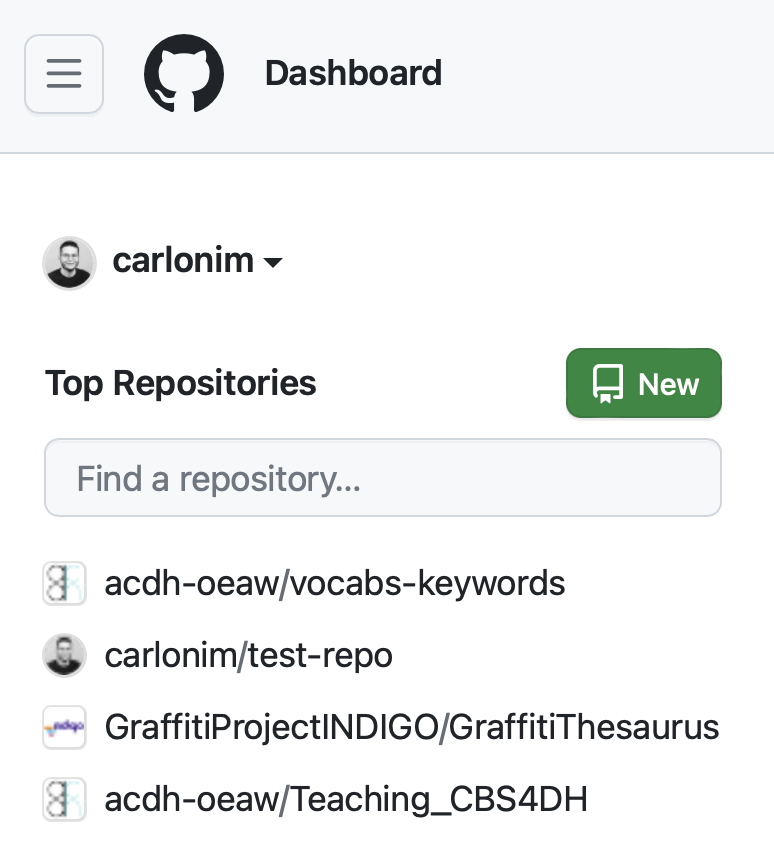
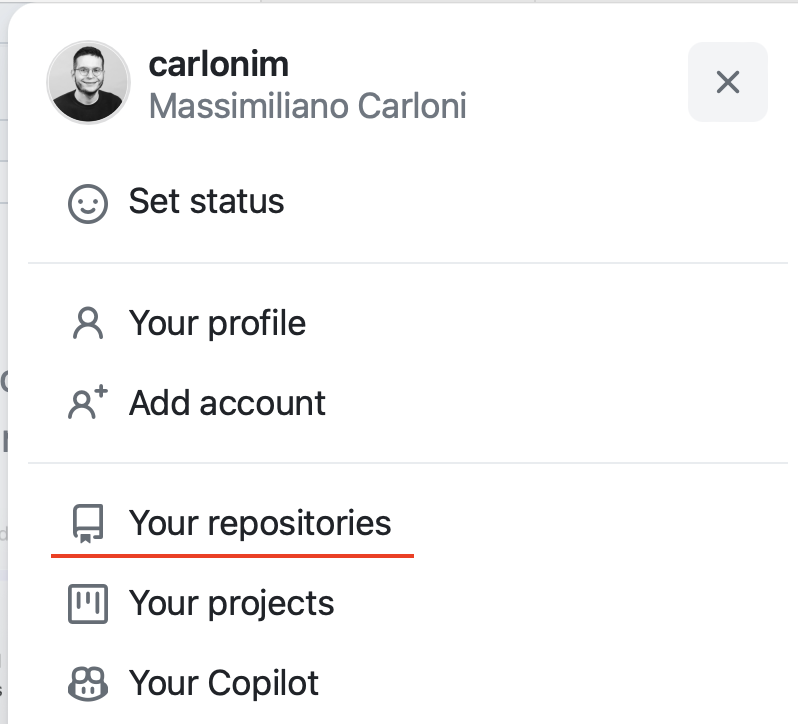

# Hands-on - Part 2

## Before starting

To be sure to have your shell **in English** for the current lesson (so that you can more easily recognize logs and error messages described in this document):

1. Type `locale` in your shell and check the value for the variable `LANG`
2. If this displays any other language (like German), you can type the command `export LANG=en_US.UTF-8`
3. Check again with `locale` if the changes were applied. This will set the language of your **current shell** to English, but will reset the language to German (or any other default) when you start a new shell session.
4. If you want to make these changes permanent (which is however *not* needed for this tutorial), you have to open the file `~/.bashrc` (for Bash users, mostly Linux and Windows) or `~/.zshrc` (for Zsh users, mostly macOS) (for example with the editor `nano`) and add the line `export LANG=en_US.UTF-8` to the file. This will execute this command every time you start a new shell session.

## GitHub

* In this hands-on, we will focus on [GitHub](https://github.com), an online service that is based on Git and that allows you to store your repositories on a remote server, so that other people can see them and collaborate by editing them.
* But many of the things we will say here also apply to other online services based on Git, such as [GitLab](https://gitlab.com).
* Some interesting repositories or accounts on GitHub/GitLab:
  * **Linux** kernel: https://github.com/torvalds/linux
  * **VLC** media player: https://github.com/videolan/vlc
  * Image editor **GIMP**: https://gitlab.gnome.org/GNOME/gimp
  * **LibreOffice** account: https://github.com/LibreOffice
  * **Netflix** account: https://github.com/Netflix
  * Some **awesome (literally) lists** of resources: https://github.com/sindresorhus/awesome
  * ... and **Visual Studio Code** itself! https://github.com/microsoft/vscode
* The GitHub web interface lets us perform some operations for which we were previously using commands on the shell. But we will partly use the command line in this section too.

## Creating a repository on GitHub

Let's now create a new repository on GitHub.

1. If you are on the [GitHub homepage](https://github.com) and you have already logged in, you might find a column on the left like this one. The **green button "New"** with the book icon lets you create a new repository.



2. Otherwise, you can click on your **profile picture** on the top right corner of the page and click on **"Your repositories"**. You will then find the **green button "New"**.



3. When creating a new repository, you can set up different aspects.
   - You could start with a **template** (an option we will not discuss here, but if you are curious, see the pages [Create a template repo](https://docs.github.com/en/repositories/creating-and-managing-repositories/creating-a-template-repository) and [Create from a template](https://docs.github.com/en/repositories/creating-and-managing-repositories/creating-a-repository-from-a-template)).
   - The important thing is specifying the **name** of your repo. As described on the GitHub page, *Great repository names are short and memorable*. So have fun trying to find out an original name! You can also provide a **description** to better explain what your repo is about.
   - Regarding the visibility of your repo, you have two options, either **Public** and **Private**. We will create a **public** repo for the purposes of this tutorial, but you could choose to have a private repo, for example, if you want to write some code before making your repo public.
   - An important step is creating a **README.md** file. Most GitHub repos have a README file. This will be placed in the upmost directory of your repo and will be displayed first when you open your repo. It is important to include such a file, because this is where you can give future users more detailed information about the contents of your repo or how to install/deploy the piece of software you are coding.
   - We will now ignore `.gitignore`, but so that you know what this is about: `.gitignore` allows you to **specify files that should never be tracked in the repo**, for example invisible files that only serve to specific operating systems (macOS has a tendency to create such files, such as `.DS_Store`, to store custom attributes of its containing folder).
   - Finally, you can choose a **license** to assign to your repo. While we can avoid to specify one for the moment, a license plays a fundamental role in determining how other people can reuse your software.
4. You can now click on the green button **Create repository**. Congratulations! :tada: You now have a repository on GitHub.

## Cloning the repository

If you go to the **GitHub page of your repository**, you can see some usual suspects here. You have an indication of the last commit, a list of files contained (for the moment, just README.md, which only contains the repo name and is rendered just below), and your description on the right (if you have provided one).

However, to really work with this repository, it is recommended to create a local copy of it on your computer. In technical terms, this corresponds to **cloning** the repository.

1. To do this, click on the green button **<> Code**. Several options will appear. We will use the **HTTPS** option, which allows to clone a repository by providing its URL, which is displayed in the text box just below.
2. To **copy the URL**, you can click on the little icon on the right (two overlapping squares). We will now return to the command line interface (CLI).
3. In the CLI, navigate (using the `cd` command) to the folder where you want to store a local copy of your repo, and type `git clone` followed by a whitespace and the URL of your repo. For example:

```shell
cd /Users/mcarloni
git clone https://github.com/carlonim/test-repo.git
```

4. You will now have a new directory which contains your GitHub repository. This local repo will already have a **remote** configured. A remote is a repository hosted elsewhere, from which you can pull data or to which you can push data. When cloning a repository, Git automatically configures a remote with name **origin**. To see the remotes associated to a repo, type the following command:

```shell
git remote
```

5. To have more information, you can add the option `-v` (i.e., "verbose") to the command.

## Push / fetch / pull

However, while the repository on your computer is an exact copy of the one on GitHub, this still does not mean that everything is automatically synchronized between the two repositories.

If you make a change to your local repo, you still need to commit your change, as done in the first part of these lectures. But when you do this, you actually commit to your local copy, while the repo on GitHub remains unchanged. To make this change effective on the GitHub repo too, you need to **push** your commit.

Let's first try to commit a change to our local repo. We can open the text editor `nano` and edit the README.md file:

```shell
nano README.md
```

We can just add a line and then quit using **Ctrl + X**, and then **Y** followed by **Return** to save the changes. We can now commit the change.

```shell
git add --all
git commit -m "Update README.md"
```

We can now check if our remote repo is up-to-date too.

```shell
git fetch
git status
```

Git will inform us that `Your branch is ahead of 'origin/main' by 1 commit`. To bring the remote repo up-to-date, we will use the command `git push` we mentioned above.

```shell
git push
```

You can now run `git status` or check the remote repo on your GitHub page. If everything worked correctly, your repo should reflect the current status of your local copy.

What happens instead if the remote repo has a new commit that is not present in your local copy? This might happen if you collaborate with other people, and somebody has committed a change while you were working on your repo. In this case, you will need the command `git pull`.

Let's try to simulate such a case. Please go to the GitHub web interface and open the README.md file by clicking on it. On the right, you will find a small icon with a pencil, which allows you to edit the file directly in the browser. Let's add a line with some text, then click on the green button **Commit changes...** Write a commit message and confirm to commit changes.

Let's now go back to the command line.

``` shell
git fetch
git status
```

Git should inform you that `Your branch is behind 'origin/main' by 1 commit`. Git has fetched the data from the remote repo and has compared it with the local repo. However, it still hasn't applied the new changes to your local repo. To do this, you need a different command:

```shell
git pull
```

Theoretically, you could even run `git pull` without running `git fetch` before, although it's always best to see what's happening before you actually pull the data.

Finally, let's try a more extreme case. Imagine that you commit another change to your remote repo (or somebody else does), and in the meanwhile you modify the same file on your local copy. If you try to push your local change to the remote, you will receive a warning from Git:

```shell
error: failed to push some refs to 'https://github.com/carlonim/test-repo.git'
```

This happens because your remote repo has changed in the meantime. If you try to run `git pull`, Git will actually abort the command, since there are diverging changes in the two repos. To allow Git to pull the changes, you have to **stash** your current changes, i.e. to save them for later, and then pull again.

```shell
git stash
git pull
```

You can view a list of your stashed changes using `git stash list`, and you can apply them again with `git stash apply`. We won't go into the details of resolving conflicts, since this would involve too much time.

## Branching

Branches are like alternative or parallel paths your repo can take. You can create a branch with name `feature1` by simply using the following command:

```shell
git branch feature1
```

To see all branches available, you can type:

```shell
git branch
```

The branch highlighted by an asterisk at the beginning is the branch in which you are currently located. If you run the command `git branch` with the option `-a`, you will list not only local branches, but also remote ones. If you add the option `-v`, you also get additional information, including the last commit message of each branch.

To switch to another branch, in our case `feature1`, you can type:

```shell
git checkout feature1
```

In some cases, you want to create a new branch and switch to it at the same time. You can do so by running:

```shell
git checkout -b feature2
```

You can now make an edit to your repo and then try to push to the remote. Git will alert you:

```shell
fatal: The current branch feature2 has no upstream branch.
```

We need to create a corresponding branch on our remote repo or at least match our local branch to a remote one. To do this, we can type:

```shell
git push -u origin feature2
```

This will automatically create a branch `feature2` on the remote, if this is not present, and will push the current changes. To check to which remote branch our corrent branch is pushing, you can use the command `git branch -vv`.

Let's now try to **merge** our changes in `feature2` with our branch `main`. This means that all the changes we introduced in `feature2` will be transferred to `main` too. To do this, we need to switch to `main` and then use the `git merge` command, followed by the name of the branch we want to merge:

```shell
git checkout main
git merge feature2
```

You can now push our updated `main` to remote.

### Create a branch from a previous commit

Branches do not need to be created from the latest commit. You can also navigate to an earlier commit and create a new branch from that too. Let's try this (where `18b1ae1`is the hash of a previous commit, retrieved through `git log`):

```shell
git checkout 18b1ae1
git checkout -b my-alternative-branch
git push -u origin my-alternative-branch
```

If you open your repo on GitHub, you will now find your new branch. GitHub will inform you that your branch is some commits behind your `main` branch.

