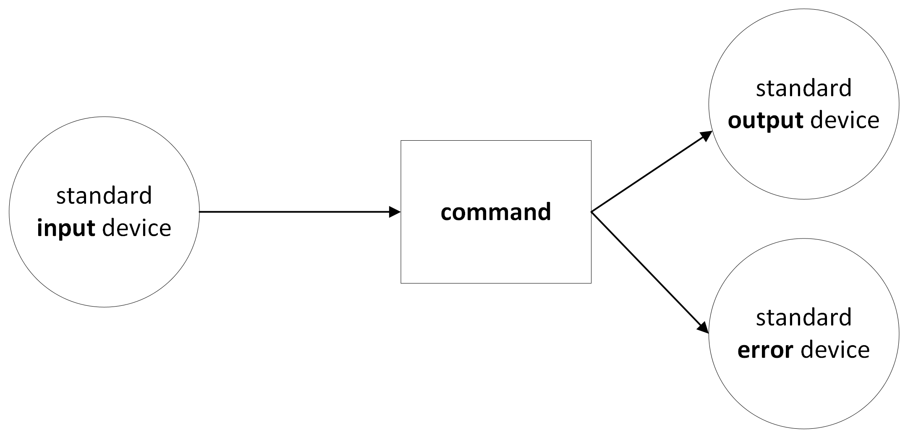

# Command line 2

> [!NOTE]
> * **References:** Much of the content of these sessions is summarized at our [Command line quick reference](command_resources.md) page.
> * **Credit:** Our materials are based on the Software Carpentry [Unix Shell](http://swcarpentry.github.io/shell-novice/) course
> * **Something to play with:** Follow the instructions at <http://swcarpentry.github.io/shell-novice/setup.html> to copy some practice files.

## General recap

### What are we using?

* We are using a **shell** based on a **command line interface** (**CLI**) to interact with the operating system.
* More specifically, we are using **bash**, which is very popular in Unix and Unix-like operating systems (like macOS and Linux), but can also be installed on Windows.
* When we refer to a CLI-based shell, we usually just say "the shell" or "the command line".

### The basics of the command line

* General structure of a command: `commmand -option(s) argument(s)`, e.g. `ls -F shell-lesson-data`
* `cd` to go to a directory
* `ls` to show what is inside a directory
* Need help? `man ls` or `ls --help`
* `cp`: copy
* `mv`: move, also used for renaming files
* `rm`: remove
* `mkdir`: make directory
* `rmdir`: remove directory
* `touch some_file`: create an empty file, change the last modification date of an existing file

## More commands!

> `cat`
> `tac`
> `tail`
> `head`
> `sort`
> `wc`
> `cut`
> `grep`
> `du`
> `df`
> `uniq`
> `seq`
> `tr`
> `file`
> `date`
> `cal`
> `nano`
> `find`
> `sleep`
> `curl`
> `wget`
> `ssh`

## Wildcards

We will work with Software Carpentry lesson [4. Pipes and filters](https://swcarpentry.github.io/shell-novice/04-pipefilter.html).

You remember the `*` symbol from yesterdays lessen? There are more such tricks:

We will be using some special characters that allow to search for undetermined characters:
* `*` = zero or more undetermined characters
* `?` = exactly one undetermined character
* `[abc]` = a set, i.e. _one_ character to be chosen among `a`, `b`, and `c`

### Examples

* `*.xml ` (files ending in ".xml"; the place occupied by `*` may be empty or contain one or more characters)
* `*.x?l` (files ending in ".x" followed by any single letter followed by "l", e.g., XML [xml], XSLT [xsl], XProc [xpl] files)
* `*.x[ms]l` (files ending in ".x" followed by "m" **or** "s" followed by "l", e.g., XML and XSLT files, but not XProc)

### Regex vs globbing

**Globbing** is annoyingly different from **regex**.
We will see what regex is in the following session, so don't worry if you don't understand everything here!

* Regex: `*` and `?` are repetition indicators for the preceding item
* Globbing: `*` and `?` are wildcards
* Glob `*` = regex `.*`
* Glob `?` = regex `.?`

## Redirection

Every command reads some data from the input (which in the shell is called **stdin**, i.e. _standard input device_) and sends out the results to the output (**stdout**, i.e. _standard output device_). If there are any errors, the command will output them to another channel (**sterr** i.e. _standard error device_).

We usually **input** data into a command by writing its argument(s) with the _keyboard_, and we see the **output** of the command _on the screen_. But what if we could change this? For example write the output to a file, or take the input from a file?

* **stdin**:
	* `<`: input from file
* **stdout**:
	* `>`: output to file (careful: overwrites existing files with the same name)
	* `>>`: append to file (creates file if it doesnÕt already exist)
* **stderr**:
	* `2>`: error messages to file (`2> /dev/null` means that the error messages will basically disappear)

For example, we can save the list of contents of a directory in a text file by simply writing this:
* `ls > some_file.txt`
* `ls some_directory > some_file.txt`

### Piping

* You can chain commands together thanks to a `pipe`, represented as `|` in the Unix shell.
	* Mac Austrian keyboard: `Option + 7`
	* Windows Austrian keyboard: `Alt Gr + 7`
* `|` pipes output of process on the left into input of process on the right
	* For example: `wc -l *.pdb | sort -n`
	* This means that the output of `wc -l *.pdb` will function as the input of the commmand after `|`, i.e. `sort -n`.
* Piping is particularly useful with filters, that can be chained together to form computational pipelines. Basically, these are the first steps for programming!

## Scripts

Let's say that you have finally built a nice pipeline of commands that you might want to reuse later. Where do you store it? Can you use it without having to type the whole pipeline again?

You can save it in a **shell script**.
* A shell script is nothing else than a program that tells the shell what to do.
* It usually has the extension `.sh`
* It is basically a file of text which contains the commands that must be executed by the shell.

For example, in our case, let's call our script `script1.sh`:
* Create a file `script1.sh` with a text editor (for example, `nano script1.sh` or just a GUI-based editor)
* Write in the first line of the file `#!/bin/bash`. This indicates that the commands must be executed by `bash`.
* Add the command you want to execute, like `wc -l *.pdb | sort -n | head -n 1`
* Save the final result
* Make this executable: in the directory where the script is contained, type `chmod 755 script1.sh`
* Execute the script with `./script1.sh` (you have to specify that the script is in your current directory by adding `./`)

**Be careful!**
* This script will execute the commands in the directory where it is stored. So, it will look for all files `*.pdb` in its directory.
* If you want to use it in another directory, you must either move the script or recall it from the directory where you want to use it (this would require a longer and complicated path).
* However, the easiest way is to include a **variable**, so that you can specify to the script where it should be applied: instead of writing `*.pdb` in its code, you can write `$@`. This means that the shell will automatically replace `$@` with whatever you input as argument of the script, e.g. `./script1.sh exercise-data/*.pdb`. This will also allow you to use the script to check for other kinds of formats too, e.g. `./script1.sh *.txt`

This is just the tip of the iceberg: scripts would require at least a whole session for itself (or even a whole course), but I hope you already got the gist of what makes the shell such a powerful tool. The shell is not only a way of interacting with the operating system, but it is also a **programming language**.
