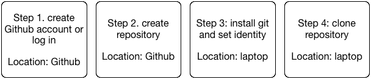
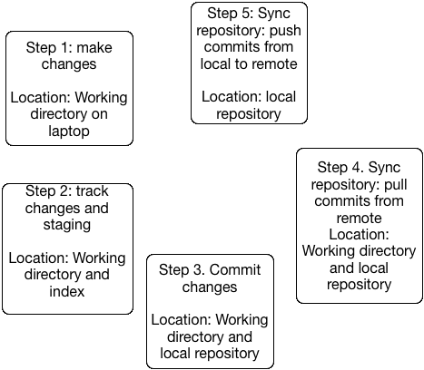
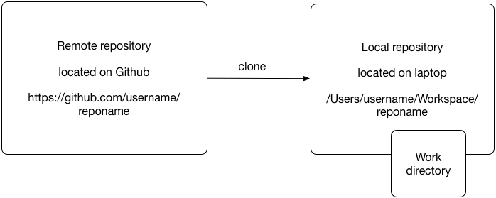
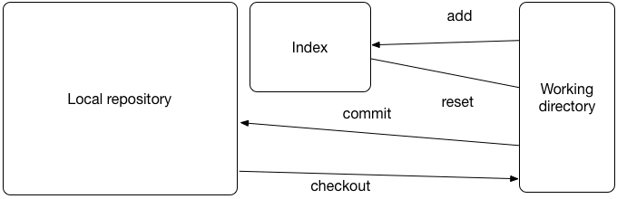
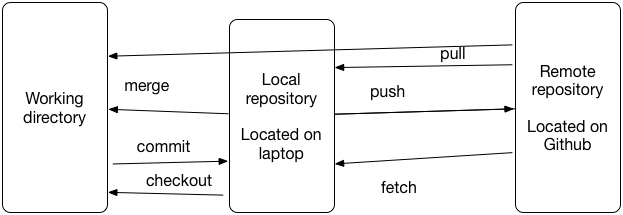
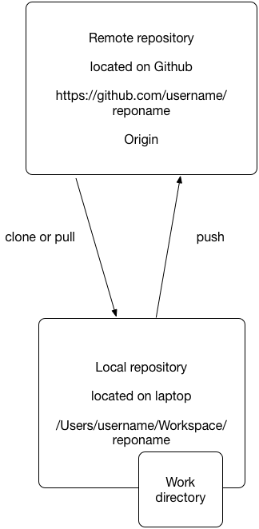
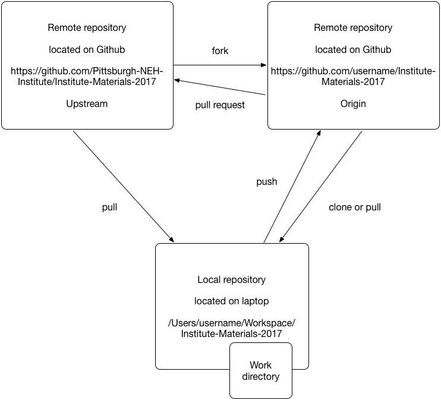
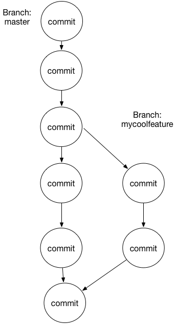

# Git

Git is a content management system, but not in the usual way you might expect from well-known Content Management Systems (CMS) like Wordpress or Drupal, or well-known file-sharing systems like Dropbox or Box. For this reason, Git is called a *content tracker*.

Git is one of the most used *version control systems* in the coding community. It is useful when working on coding projects, alone or in a group: it keeps track of each stage of the process, and allows you for instance to go back and restore to an earlier version.

Git is a distributed version management control system. That means that every project member has a copy of the complete history of all the files in the project on their machine. Contrast this with centralized version control systems such as Subversion (SVN) were users only have the last version of a file on their system. In this workshop, we are going to use *remote* repositories, which are located om a server on Github, as well as a *local* repository that is located on your own machine.

In this tutorial, we will work both in the browser and in a terminal window. We use the browser to administer remote Git repositories; we work in the terminal for everything regarding the local Git repository.  

Git is a command line tool with which one can administer local and remote Git repositories, allowing you to version your files and share them easily with others within a project.

Github is an online service that hosts Git repositories (public as well as private) and provides social network functionality to users. Users can add issues, construct a wiki, create tasks and create pull requests on the web-site. 
 
What you need to get started with Git:

* a Github account
* basic knowledge of the command line

If you don't have a Github account, create one here:
<https://github.com>

## Preparation



## General workflow 



## Create a new Github repository

* Go to your browser
* Go to <https://github.com/>
* Log in to your account
* In the upper-right corner of any page, click , and then click New repository.
* In the Owner drop-down, select the account you wish to create the repository on.
* Type a name for your repository, and an optional description.
* You can choose to make the repository either public or private. Public repositories are visible to the public, while private repositories are only accessible to you, and people you share them with. We choose public for this tutorial.
* There are a number of optional items you can pre-populate your repository with. If you're importing an existing repository to GitHub, don't choose any of these options, as you may introduce a merge conflict. You can choose to add these files using the command line later.
	* You can create a README, which is a document describing your project.
	* You can create a CODEOWNERS file, which describes which individuals or teams own certain files in the repository.
	* You can create a .gitignore file, which is a set of ignore rules.
	* You can choose to add a software license for your project.
	* For this exercise choose to at least add a `README` file. You can choose to add a license if you like. 	
* When you're finished, click Create repository.

Your repository will be located at `https://github.com/username/repositoryname`.

## Set your identity on your local machine

When you start working with Git you need to set your identity. Git tracks who changes what in each file. Therefore you need to identify yourself before you are able to make changes and commit them. This identity will be used to track all the changes that you make to content in a repository. You only have to do this once on each machine that you use.

Open a terminal window and type the following commands, replacing John Doe with your name and the email-address with your own email address:

* `$ git config --global user.name "John Doe"`
* `$ git config --global user.email johndoe@example.com`

## Cloning remote repositories



To work with the repository we just created we need to transfer the data from the remote repository to the local machine. Copying a remote repository to the local machine is called cloning in Git. For completeness sake I also included in the table below the git command to create a new repository on the local machine. 

Working with Git repositories is completely command line and file based, so the knowledge that you acquired about the command line and the file system over the past couple of days will come in very handy here.

Command | Description
------- | -----------
`git clone` |   Copy an existing repository from a remote location (for example GitHub)
`git remote` |  View and manage remote repositories
`git init` |   Create a new repository locally

* Create a directory in your home directory called Workspace were we store all the cloned repositories.

```bash
$ cd ~
$ mkdir Workspace
$ cd Workspace
```

Now we clone the repository that we just made on GitHub to the local machine.

```bash
$ git clone https://github.com/username/repositoryname
$ cd repositoryname
$ ls -lisa
```

There should be your files. 

Now we run the git remote command to see whether the remote repository is correctly linked with the local repository.

`$ git remote -v`

Sample outcome:

```bash
origin	https://github.com/username/repositoryname (fetch)
origin	https://github.com/username/repositoryname (push)
```

What *fetch* and *push* stand for we will get into later (under section syncing repositories)

## Working directory

When you have a terminal window open, you are in what is called the *working directory*. The complete repository, with all the changes that people have ever made, is present, but in the background. Information other than current versions of your files is outside your working directory, but you can reach it when you need it.

## Making some changes

* Use your favorite editor to edit files (and you can use different editors for different files in the same project)
* PyCharm (for Python projects), \<oXygen/\> (for XML projects), vim, notepad++, BBEdit, etc.

## Working with changes locally and tracking them



Command | Description 
--------|-----------------
`git status` | Show which files are modified locally or new
`git diff` |  Show changes
`git add`  |   Add a file to change tracking and stage  
`git reset HEAD` |  Untrack a file or unstage 
`git checkout` | Undo changes to a file (before commit)

## Committing changes

Command | Description 
--------|-----------------
`git commit` | Make changes permanent
`git log`  | Show history of commits
`git reset HEAD~` | Undo the last commit, retain changes in the working directory
`git reset HEAD~ --hard` | Undo the last commit, remove changes from the working directory

`git commit -a` adds all changed files and commits the changes, that is, it combines `git add` with `git commit`. **But it only adds files that have changed, and not files that are completely new.** The only way to add a new file is with `git add`.

For example:

```bash
$ git add .
$ git commit -m "added a new feature some files changed"
```

If you make a mistake with a commit (forgot to add new files, or messed up your commit message)

`$ git reset HEAD~`

Note that there is a difference between files and commits. A commit can consist (and usually does) of multiple files. Git tracks commits and content, not single files.

vim is the default editor in Git (on all operating systems). When you type `git commit`, you are taken into vim to enter a _commit message_, where you record information about the commit. The most important vim commands are:

You type | What happens
---- | ----
`Esc` | enter command mode
`i` | enter insert mode
`:wq` | write your changes and quit
`:q!` | cancel (quit without writing changes)

The use of the escape key in Vim, the `i` for insert mode, `:wq` and `:q!` to cancel 

# Syncing repositories



Command | Description
------- | -----------
 `git pull` | Fetch the commits from a remote repository and merge them with the current working directory (i.e. does a fetch and a merge in one)
 `git push` | Push the commits from the local repository to a remote repository 
 `git fetch` | Fetch the commits from a remote repository into the local repository
 `git merge` | Merge the commits from the local repository with commits fetched from a remote repository (actually this works on branches; this will be explained in the git tutorial part 2)

## Terms learned

* Repository
* Clone / Origin
* Working directory
* Commit
* Push and pull

## Using a central repository for a project



## Forking repositories



* Log in to Github
* On Github fork the NEH Institute Materials 2017 repository
* Clone you fork to your local machine.
In your Workspace directory in your home directory do:
`$ git clone https://github.com/Pittsburgh-NEH-Institute/Institute-Materials-2017`
* On your local machine add the original repository as a second remote repository called upstream

```bash
$ git remote -v
origin  https://github.com/YOUR_USERNAME/YOUR_FORK.git (fetch)
origin  https://github.com/YOUR_USERNAME/YOUR_FORK.git (push)

$ git remote add upstream https://github.com/Pittsburgh-NEH-Institute/Institute-Materials-2017

$ git remote -v
origin    https://github.com/YOUR_USERNAME/YOUR_FORK.git (fetch)
origin    https://github.com/YOUR_USERNAME/YOUR_FORK.git (push)
upstream  https://github.com/ORIGINAL_OWNER/ORIGINAL_REPOSITORY.git (fetch)
upstream  https://github.com/ORIGINAL_OWNER/ORIGINAL_REPOSITORY.git (push)
```

## Pull requests: making changes and submitting a pull request

* Create changes
* Track changes
* Commit changes
* Push commits 
* Create pull request on github 

## How to work with branches

What you think Git is:


What Git really is:



Command | Description
--------|------------
`git branch -a`|   Show all the branches in your local repository
`git branch -a -v` | Show all the branches and their last commits
`git branch <name>`   |   Create a new branch based on the last of commit of the current branch
`git checkout <name>` |   Switch from one branch to another
`git checkout -b <name>` | Create a new branch and switch to it
`git stash`    |   Temporarily move changed files out of the way
`git stash apply` | Reapply changes that were stashed previously

## How a merge works


Command | Description
--------|------------
`git merge <branch>` | Merge commits from one branch into the other.
`git merge --abort` | Abort a merge 

* Make sure you do not have uncommitted changes.
* If so, stash them or commit them
* Check that you are in the right branch with `$ git status`.
* If not do git checkout
* Do `$ git merge <branch>`
* `$ git push`

## How to resolve a merge conflict

## Notes

* A fork is a remote repository on GitHub. 
* Forking has to do with permissions.
* Explain difference between a fork and a branch
* A fork is not a branch, a fork is a repository, a branch is a series of commits.
* Explain git status "ahead / behind origin/master" line
* Explain difference between a pull and a fetch
* The Git `pull` command is not the same as a *pull request* on GitHub.
* Git does not track empty directories or empty files.

## Terms learned part 2

* Fork (GitHub term)
* Pull request (GitHub term)
* Branch
* Merge, merge commit, merge conflict
