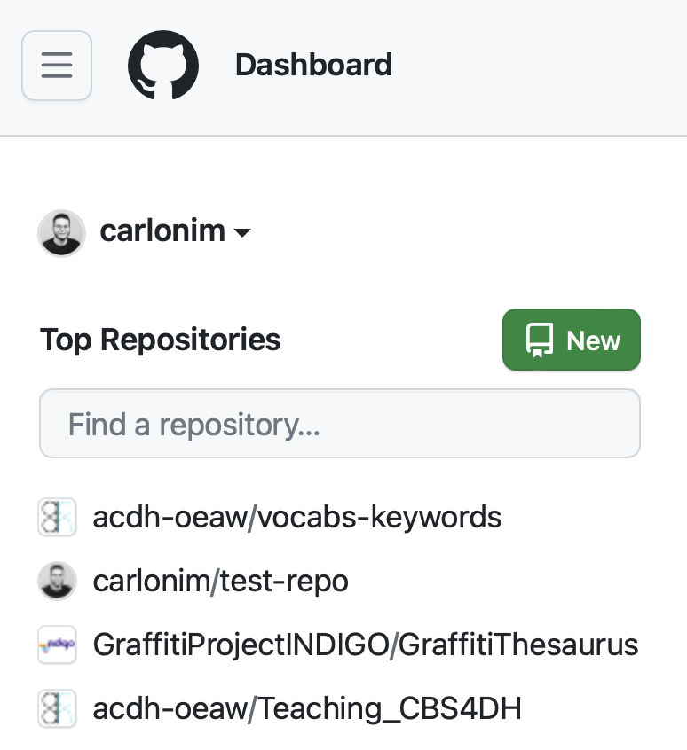
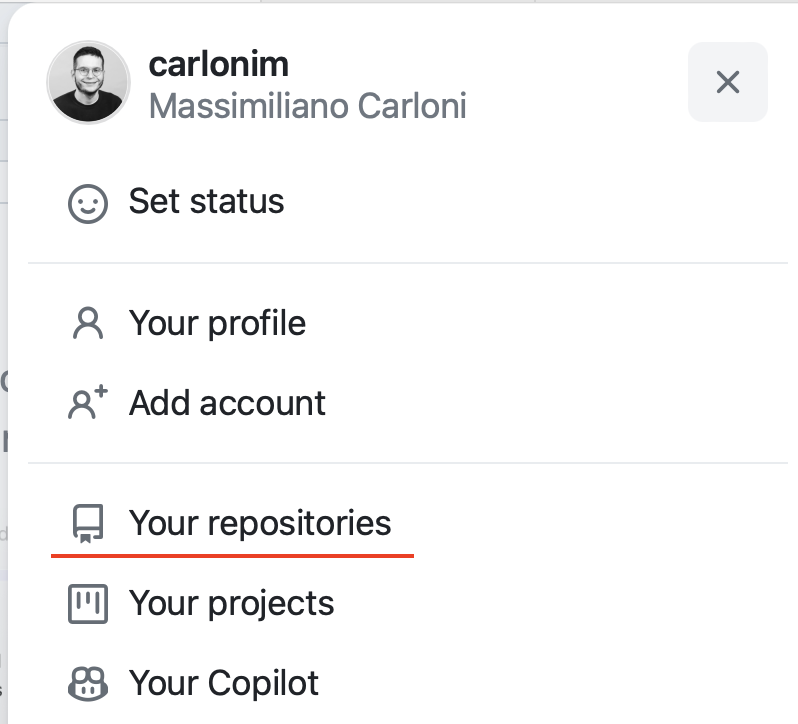
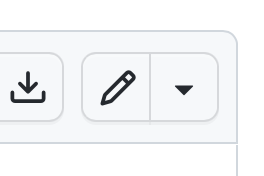

# Git 1

Git was released by Linus Torvalds, the creator of Linux, in 2005. It is a **version control system** that helps you **keep track of changes** to files over time. More precisely, Git is a **distributed** version control system: when several people collaborate on the same project, each can have a complete local copy of the files of that project, make changes independently, and later merge their work with others. Git is great for **collaboration**, as it offers several tools that facilitate collaborative work, such as "branches" (alternative timelines of a project).

You might have heard of [GitHub](https://github.com) (on which we will focus in this hands-on) or [GitLab](https://about.gitlab.com). Both are online services that are **based on** Git – but remember, you can also use Git independently of any online service.

## 1. Introducing GitHub

* In this hands-on, we will focus on [GitHub](https://github.com), an online service that is based on Git and that allows you to store your repositories/repos on a remote server. Two main features of GitHub are important here:
  * First, GitHub allows you to share your repos, so that other people can see them (open source)
  * Secondly, GitHub keeps track of changes made to your repos (called **commits**), including who made the change and why (if a meaningful message was included with the commit). This makes collaborating on the same repository much easier.
* Many of the things we will say here also apply to other online services based on Git, such as [GitLab](https://gitlab.com), and in general to Git. Actually, you have to install Git on your computer to be able to work locally on the files stored in GitHub (e.g., if you want to edit a file and upload it to your GitHub repository).
* Let's make sure that the `git` command is available: in the shell, type `git --version` or `git -v`
  * If the result if a version number, like `git version 2.50.1`, no worries, Git is installed.
  * For Mac users: a new window might pop up, which invites you to install the Xcode command line tools. In that case, confirm to install. This might take some time, since the tools will be downloaded automatically from the web. Afterwards, you can check if git was installed by closing the Terminal, opening a new one, and typing `git --version` or `git -v`.
  * If the window didn't pop up and git is not installed, you can try running `xcode-select --install` in the shell. This should prompt you to install the above-mentioned Xcode command line tools.

* Some interesting repositories or accounts on GitHub/GitLab:
  * **Linux** kernel: https://github.com/torvalds/linux
  * **VLC** media player: https://github.com/videolan/vlc
  * Image editor **GIMP**: https://gitlab.gnome.org/GNOME/gimp
  * **LibreOffice** account: https://github.com/LibreOffice
  * **Netflix** account: https://github.com/Netflix
  * ... and **Visual Studio Code** itself! https://github.com/microsoft/vscode
* GitHub is not only for code; it is especially useful for text in general, in particular Markdown:
  * Some **awesome (literally) lists** of resources: https://github.com/sindresorhus/awesome 
  * Our own **CBS4DH** repository! https://github.com/acdh-oeaw/Teaching_CBS4DH/tree/2026S  
* You (or your organization) can have your own profile on GitHub: 
  * Peter: https://github.com/csae8092 
  * ACDH: https://github.com/acdh-oeaw 
  * Single projects: https://github.com/Auden-Musulin-Papers
* By sharing the code, you encourage other people to contribute to it, or inspire them to use it as basis for their own future projects
  * You cannot make changes to any repository, if you don’t have the rights 
  * But you can make your own “copy” of a repository and work on that (it’s called **fork**)
* Code stored on GitHub is also used as training material for LLMs
* Social dimension of GitHub
  * **Star** interesting repositories 
  * **Watch** them --> get updates on them
  * Your profile can be used as a kind of “portfolio” if you’re applying for a job 
  * Send feedback in form of **issues** (examples: https://github.com/acdh-oeaw/histogis/issues, https://github.com/Auden-Musulin-Papers/amp-data/issues)

## 2. Creating a repository on GitHub

Let's now create a new repository on GitHub.

1. If you are on the [GitHub homepage](https://github.com) and you have already logged in, you might find a column on the left like this one. The **green button "New"** with the book icon lets you create a new repository.



2. Otherwise, you can click on your **profile picture** on the top right corner of the page and click on **"Your repositories"**. You will then find the **green button "New"**.



3. When creating a new repository, you can set up different aspects.
   - You could start with a **template** (an option we will not discuss here, but if you are curious, see the pages [Create a template repo](https://docs.github.com/en/repositories/creating-and-managing-repositories/creating-a-template-repository) and [Create from a template](https://docs.github.com/en/repositories/creating-and-managing-repositories/creating-a-repository-from-a-template)).
   - The important thing is specifying the **name** of your repo. As described on the GitHub page, *Great repository names are short and memorable*. So have fun trying to find out an original name! You can also provide a **description** to better explain what your repo is about.
   - Regarding the visibility of your repo, you have two options, either **Public** and **Private**. We will create a **public** repo for the purposes of this tutorial, but you could choose to have a private repo, for example, if you want to write some code before making your repo public.
   - An important step is creating a **README.md** file. Most GitHub repos have a README file. This will be placed in the upmost directory of your repo and will be displayed first when you open your repo. It is important to include such a file, because this is where you can give future users more detailed information about the contents of your repo or how to install/deploy the piece of software you are coding. However, for the purposes of this tutorial, we will **not** include a README.
   - We will now ignore `.gitignore`, but so that you know what this is about: `.gitignore` allows you to **specify files that should never be tracked in the repo**, for example invisible files that only serve specific operating systems (macOS has a tendency to create such files, such as `.DS_Store`, to store custom attributes of its containing folder).
   - Finally, you can choose a **license** to assign to your repo. While we can avoid to specify one for the moment, a license plays a fundamental role in determining how other people can reuse your work.
4. You can now click on the green button **Create repository**. Congratulations! :tada: You now have a repository on GitHub.

## 3. Before starting with the command line

In the next steps, we will work with the command line/shell. To be sure to have your shell **in English** for the current lesson (so that you can more easily recognize logs and error messages described in this document):

1. Type `locale` in your shell and check the value for the variable `LANG`
2. If this displays something like `LANG="en_US"` or `LANG="en_US.UTF-8"` (for US English), you are ready to go. There is also the case that `LANG` is not filled out; in that case, just run `git` and see if the messages appear in English. If `LANG` displays any other language (like German), you can type the command `export LANG=en_US.UTF-8`.
3. Check again with `locale` if the changes were applied. The new settings will only apply to your **current shell** to English, but the langauge will reset to German (or any other default) when you start a new shell session.
4. If you want to make these changes permanent (which is however *not* needed for this tutorial), you have to open the file `~/.bashrc` (for Bash users, mostly Linux and Windows) or `~/.zshrc` (for Zsh users, mostly macOS) (for example with the editor `nano`) and add the line `export LANG=en_US.UTF-8` to the file (remember, `~` represents your home directory). This will execute this command every time you start a new shell session.

## 4. Cloning the repository

To really work with the repository you created, it is recommended to create a local copy of it on your computer. In technical terms, this corresponds to **cloning** the repository.

1. If you created a totally empty repository, you will find a selector HTTPS / SSH and a text box that contains a URL. Make sure that **HTTPS** is selected.
   Otherwise, if your repository is not empty (e.g., you included a README.md), you can click on the green button **<> Code**. Several options will appear. We will use the **HTTPS** option, which allows to clone a repository by providing its URL, which is displayed in the text box just below.
2. To **copy the URL**, you can click on the little icon on the right (two overlapping squares) in the text box. We will now return to the command line interface (CLI).
4. In the CLI, navigate (using the `cd` command) to the folder where you want to store a local copy of your repo, and type `git clone` followed by a whitespace and the URL of your repo. For example:

```shell
cd /Users/mcarloni
git clone https://github.com/carlonim/test-repo.git
```

5. You will now have a new directory which contains your GitHub repository. Move inside this directory (e.g. ``cd test-repo`). This local repo will already have a **remote** configured. A remote is a repository hosted elsewhere, from which you can pull data or to which you can push data. When cloning a repository, Git automatically configures a remote with name **origin**. To see the remotes associated to a repo, type the following command:

```shell
git remote
```

6. To have more information, you can add the option `-v` (i.e., "verbose") to the command.

7. (Optional) Take a quick look at the newly created `.git` directory:
    + List contents of current directory (`-a` option shows hidden items): `$ ls -a`
    + List contents of `.git`: `$ ls .git`
    + View `.git/config` file: `$ cat .git/config`

## 5. Still a little bit of patience... Other preparatory steps

Before we actually make changes to the repository, it is important we make sure that everything is set up correctly.

1. One-time Git setup (set author info, text editor, line endings). If you just want to see what values are contained here before editing, type the command without the part between quotes, e.g. `git config --global user.name`.
    + `$ git config --global user.name "<your name>"`
    + `$ git config --global user.email "<username>@users.noreply.github.com"`
    + `$ git config --global core.editor "nano -w"`
    + `$ git config --global core.autocrlf input` for Mac/Linux, `true` for Windows
    + Check settings: `$ git config --global --list` (or `$ cat ~/.gitconfig`)

+ __Notes__:
    + The email you set here will potentially be visible to everyone on the internet, which is why you might want to use the scheme above.
    + By default, the text editor is used for writing commit messages, but you can also use `git commit -m '<message>'`. Set your preferred editor of course.
    + These (and all other config settings) can also be set on a per-repository level by omitting the `--global` flag. Per-repository settings are stored in the `.git/config` file.
    + For more information on line endings (and Git config in general), see <https://www.git-scm.com/book/en/v2/Customizing-Git-Git-Configuration#_core_autocrlf>.

## 6. Working with files and commits from the command line

1. Create and save a new text file with some text (traditionally "hello world") in it: `$ echo 'hello world' > hello.txt` (or use your favorite text editor)
	- If you prefer, you can also use the `touch` command to create an empty new file (`touch hello.txt`), then open it in a text editor and write the line `hello world`.
2. `$ git status` should list the newly created file under "Untracked files".
3. Mark the new file for inclusion into the next commit: `$ git add hello.txt` (you may get a warning about line endings, which you can ignore in this case)
4. `$ git status` should now list the new file under "Changes to be committed".
	- Any time you are unsure about what to do, use `git status`! It's always a big helper.
7. Big moment: `$ git commit` will prompt you to add a commit message (e.g. "add hello.txt") in the configured text editor; save and exit to complete the process (or use `$ git commit -m 'add hello.txt'` to skip the editor).
	- If you're using `nano` as text editor, you can write the message, then quit using **Ctrl + X**, and hit **Y** followed by **Return** to save the changes.
8. Take a look at the commit history with `$ git log`.
	+ __Note:__ `git log` and other Git commands may use a pager (`less` by default) for output that exceeds the height of your terminal window; use arrow keys to scroll and `q` to exit.
9. To make this change effective on the GitHub repo too, you need to **push** your commit.
```shell
git push
```
At this point, Git will probably ask you for your **GitHub credentials**. However, if you insert your username and then your password, you will receive an error message, since this way of accessing GitHub outside of a web browser is not supported anymore. Windows users might get prompted to insert their credentials on the GitHub website. Mac users might need a different solution, i.e. creating a **personal access token**, a sequence of characters that will take the place of our password (in this scenario) but will allow us to have more control on what Git (or other applications) can do with our remote repositories.

## 7. Intermezzo: Create a GitHub personal access token

1. Go to the [GitHub](http://github.com) page and **log in** if necessary.
2. Click on your profile picture on the right, then on **Settings**.
3. Scroll down the bar on the left side until you reach the option **Developer Settings**.
4. Click on **Personal access tokens** and choose **Tokens (classic)** (in case you see more than one option).
5. You can now create a new personal access token by clicking on **Generate new token**, then **Generate new token (classic)** (if you see more than one option).
6. If you have enabled **two-factor authentication**, this might prompt you to take your other device to verify it's you.
7. Write a descriptive name for your token in the **Note** field.
8. You can set an expiration date, for example **30 days**, after which this token will not be usable anymore.
9. Under **Select scopes**, choose **repo** (in bold typeface), which will select all the related checkboxes below.
10. Scroll down the page and click on the green button **Generate token**.
11. GitHub will now display a very long sequence of characters. As the page reminds you, this is your personal access token and **you won't be able to see it anymore**. If you accidentally close the page now, you will need to create a new token (no problem, in any case).
12. **Copy** the token and go back to the command line.

## 8. git push (for real, now)

1. We can now try to run `git push` again.
2. When prompted for your GitHub credentials, **enter your username** and then, instead of your password, **paste the token** you just created.
3. You can now run `git status` or check the remote repo on your GitHub page. If everything worked correctly, your repo should reflect the current status of your local copy.

**Little exercise:** you can repeat the whole process by adding a second line to your `hello.txt` file, commit the change, and push it to the remote repository.

## 9. Fetch and pull from remote

What happens instead if the remote repo has a new commit that is not present in your local copy? This might happen if you collaborate with other people, and somebody has committed a change while you were working on your repo. In this case, you will need the commands `git fetch` and `git pull`.

Let's try to simulate such a case.

1. Go to the GitHub web interface and open the **hello.txt** file by clicking on it.
2. On the right, you will find a **small icon with a pencil**, which allows you to edit the file directly in the browser.



3. Let's add a line with some text, then click on the green button **Commit changes...** Write a commit message and confirm to commit changes.

4. Let's now **go back to the command line** and run these commands:

``` shell
git fetch
git status
```

5. Git should inform you that `Your branch is behind 'origin/main' by 1 commit`. Git has fetched the data from the remote repo and has compared it with the local repo. However, **it still hasn't applied the new changes to your local repo**. To do this, you need a different command:

```shell
git pull
```

Theoretically, you could even run `git pull` without running `git fetch` before, although it's always best to see what's happening before you actually pull the data.

## Cheatsheets

* GitHub: https://education.github.com/git-cheat-sheet-education.pdf
* GitLab: https://about.gitlab.com/images/press/git-cheat-sheet.pdf

## Instructors

* Massimiliano Carloni (massimiliano.carloni@oeaw.ac.at)
* Lukas Plank (lukas.plank@oeaw.ac.at)

Lessons based on material by Massimiliano Carloni and Peter Provaznik (peter.provaznik@oeaw.ac.at).
