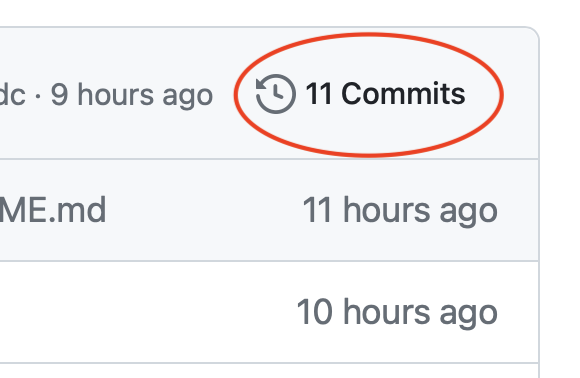

# Git 2

## What if local *and* remote have changed? (stash)

Finally, let's try a more extreme case. Imagine that you commit another change to your remote repo (or somebody else does), and **in the meanwhile you modify something else on your local copy**. If you try to push your local change to the remote, you will receive a warning from Git:

```shell
error: failed to push some refs to 'https://github.com/carlonim/test-repo.git'
```

This happens because your remote repo has changed in the meantime. If you try to run `git pull`, Git will actually abort the command, since there are diverging changes in the two repos. To allow Git to pull the changes, you have to **stash** your current changes, i.e. to save them for later, and then pull again.

```shell
git stash
git pull
```

After you have pulled, you can view a list of your stashed changes using `git stash list`, and you can apply them again with `git stash apply`. We won't go into the details of resolving conflicts, since this would involve too much time.

## Branching

**Branches** are like alternative or parallel paths your repo can take.

1. You can create a branch with name `feature1` by simply using the following command:

```shell
git branch feature1
```

2. To see **all branches available**, you can type:

```shell
git branch
```

3. The branch highlighted by an **asterisk** at the beginning is the branch in which you are currently located. If you run the command `git branch` with the option `-a`, you will list not only local branches, but also remote ones. If you add the option `-v`, you also get additional information, including the last commit message of each branch.

4. To **switch** to another branch, in our case `feature1`, you can type:

```shell
git checkout feature1
```

5. In some cases, you want to **create a new branch *and* switch to it** at the same time. You can do so by running:

```shell
git checkout -b feature2
```

6. You can now make an edit to your repo and then try to push to the remote. Git will alert you:

```shell
fatal: The current branch feature2 has no upstream branch.
```

7. We need to **create a corresponding branch** on our remote repo or at least match our local branch to a remote one. To do this, we can type:

```shell
git push -u origin feature2
```

8. This will automatically create a branch `feature2` on the remote, if this is not present, and will push the current changes. To check **to which remote branch** our corrent branch is pushing, you can use the command `git branch -vv`.

9. Let's now try to **merge** our changes in `feature2` with our branch `main`. This means that all the changes we introduced in `feature2` will be transferred to `main` too. To do this, we need to switch to `main` and then use the `git merge` command, followed by the name of the branch we want to merge:

```shell
git checkout main
git merge feature2
```

10. You can now push our updated `main` to remote.

### Create a branch from a previous commit

Branches do not need to be created from the latest commit. You can also navigate to an **earlier commit** and create a new branch from that too. Let's try this (where `18b1ae1` is the hash of a previous commit, retrieved through `git log`):

```shell
git checkout 18b1ae1
git checkout -b my-alternative-branch
git push -u origin my-alternative-branch
```

If you open your repo on GitHub, you will now find your new branch. GitHub will inform you that your branch is some commits behind your `main` branch.

## Exercise 1 - set-up for collaboration

Let's see how you can invite other people to collaborate to your repo.

1. Create a **new repo** on GitHub, or use the **existing one** you have created previously.
2. Invite as a collaborator another person. Go to your repo page, and click on **Settings**.
3. On the left bar, click on **Collaborators**.
4. Click on the button **Add people**. When asked, insert the username of the other person.
5. The other person will receive an email, where they can **accept the invitation**.
6. You can now both edit and push to the repository.

## Exercise 2 - collaborating

Now, given that more than one person can access your repo, let's try to see how collaboration works by making some changes.

1. Both you and the other person **clone** the repo on your machine (if you have not already).
2. Make some edits (I would suggest **adding a new document** with some text to avoid conflicts).
3. **Commit** the changes with a message and **push** to remote.
4. On your repo page, you can see the **history of commits** by just clicking on this link. You will notice commits coming from different users.



## Exercise 3 - branching

If you have some time left, you can try to use branching in this collaborative setup.

Person/group 1:

1. Create a **new local branch** `bug-fix` based on the latest commit. Choose the name you prefer.
2. **Push** the branch to remote.
3. Make some changes, for example create a new document with some text, and **commit** them.
4. **Push** again.

Person/group 2:

1. Make a change to the `main` branch and **commit**.
2. Run `git fetch`.
3. Check what branches are available in the remote repo by running `git branch -a`. You will see **remote branches** at the end of the list (prefixed with `remotes/origin/`), and you might see the branch `remotes/origin/bug-fix` created by the other person/group (if already pushed).
4. Create a **new local branch** based on the remote branch: `git branch bug-fix origin/bug-fix`
5. **Switch** to the new branch to check if everything is correct: `git checkout bug-fix`
6. **Switch** back to main: `git checkout main`
7. Run **diff** on the two branches: `git diff main bug-fix`
8. **Merge** `bug-fix` with the `main` branch: `git merge bug-fix`

Person/group 1:

1. **Fetch** and **pull** to see all the changes applied.

## Instructors

* Massimiliano Carloni (massimiliano.carloni@oeaw.ac.at)
* Dimitra Grigoriou (dimitra.grigoriou@oeaw.ac.at)

Lessons based on material by Massimiliano Carloni and Peter Provaznik (peter.provaznik@oeaw.ac.at).