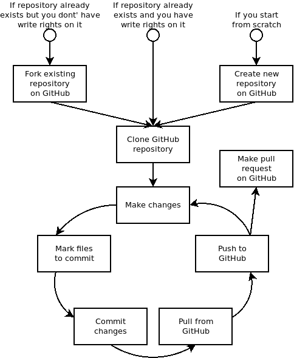

# Git 1

## Opening remarks

* *Git* can mean a lot of things. For the sake of this lecture we assume the *git* is an environment for sharing files (with some goodies like keeping history of changes, etc.).
* The git environment consists of many pieces which can be provided by many vendors. We do not have time to dig into that. We will just go trough one possible setup based on the GitHub (because we - lectures - use it every day and feel comfortable with it) so you can see how it works. The way it works with other vendors can differ here and there but these differences are not that severe and important (it is like driving a car - if you know how to drive a VM Golf you will most likely manage driving any other compact car out there).
* The *git* can be used in many ways (e.g. in a centralized or distributed setup, witch extensive use of branches or not, etc.) and people write whole volumes about it. Again, we do not have time to discuss all possibilities. We will just present you a workflow which should do the job for you at the beginning of your git adventure.

## Initial intuitions

You likely used some kind of file sharing service already, e.g. a Dropbox, Google Drive, Ms OneDrive, YouNameIt.
Well, git's aim is more or less the same - assure all parties involved in the collaboration have access to the up to date file versions.
Just in the process of achieving that the accents are put on different aspects of the process:

* File sharing services tries to do the work as automatically and transparent as possible. In most cases you do not have to do nothing but assure you are connected to the Internet.
* Git focuses on giving you control on how the sharing is performed. Which is a lot more work on your side but it also allows you keep things in order in complex collaboration scenarios where ordinary file sharing services would give up.

To synchronize the change you made with your collaborator in git you have to:

* Manually confirm the change should be remembered (so called **commit**)
* Manually move it to the place reachable for your collaborators, e.g. GitHub (so called **push**)
* And finally your collaborator has to actively synchronize (so called **pull**)

It is worth nothing that file sharing services do exactly the same, just without asking you about it (until they really have to, e.g. in case of conflicting changes).

The git approach may look overcomplicated and it certainly brings too much trouble for sharing a Christmas presents list across the family but as the size of the projects you are involved in will grow you should actually find useful the amount of control the git provides.

## Git configuration

Before you start using git on your machine, set up a few configuration options using the console:

* `git config --global user.name "My Name"` (so others know who made changes)
* `git config --global user.email My email address` (so others can contact you)
* `git config --global core.editor "nano -w"` (so git uses a user-friendly text editor on the console)


## Git circle of life

When you use git, you just spin around in the circle of **commits**, **pulls** and **pushes**:



But to get there you first need to obtain a repository on GitHub which you are allowed to write (push) to. Which leads us to the topic of the repository initialization.

### Repository initialization

First of all you need a [GitHub account](https://github.com/join). Then:

* If you start from scratch, just [create a new one](https://docs.github.com/en/get-started/quickstart/create-a-repo).
* If the repository you want to work with already exists:
  * and you have write rights on it (because you created it or someone who created it granted you such rights), then you are lucky and can jump directly to the next step;
  * and you do not have write rights on it (or you do not know if you have which most probably means you do not), then **[fork it](https://docs.github.com/en/get-started/quickstart/fork-a-repo)**.
    Forking a repository basically means creation of its exact copy which belongs to you.

Once you have a GitHub repository with write rights, you can **[clone](https://docs.github.com/en/repositories/creating-and-managing-repositories/cloning-a-repository)** it.

* Cloning means creation of a repository copy in other place, e.g. on your laptop. Internally it consists of a few steps (see the citation block below for details) but who would run them manually if it can all be done with a single command?
* Cloning is like accepting an invitation to share a folder on Dropbox, Google Drive, etc. (which is actually pretty accurate comparison because both is typically done with special URLs).

> What `git clone repositoryURL directoryName` actually does is:
>
> * create a directory named `directoryName` and enter it
> * run `git init` (initialize an empty repository)
> * run `git remote add origin repositoryURL` (link the just created repository with the remote one we are cloning and assigning the remote repository a name of "origin")
> * run `git fetch origin` (download all the data from the repository we are cloning)
> * run `git checkout --track origin/{origin's default branch}` (load the current state of the repository we are cloning and perform some configuration)

After cloning the repository:

* The whole repository content including history of changes, alternative versions of same files (more on that in a moment), etc. is stored in a magic directory called `.git` (depending on your file browser settings you may see it or it may be a hidden directory).
* The up-to-date version of the repository which you see as files and directories, just like with any other files sharing service like Dropbox, Google Drive, etc.

### Preserving changes and sharing them
 
As you can see all the files and directories in your file explorer, you can just start adjusting them (or deleting or creating new ones or doing all of it).
Once you feel you are done and ready to share your outcomes you must:

* Tell git changes in which files you want to preserve. This is done with `git add pathToTheFile`.  
  If you add a directory all files contained in it are added automatically so to add all changes you made you can just run `git add .` in the repository directory.
* Tell git to preserve the changes (make the migthy **commit**): `git commit -m 'a short description of the changes you made'`.
* Apply any changes someone else might done in the mean time (of course there might be none) by making a **pull**: `git pull origin`.  
  * This is the most thrilling action as it might turn out that someone made changes in same files as you and there is a **conflict**.
    If it is the case, git will provide you a list of files with conflicts and ask you to solve them. It will also adjust conflicting file contents so you see both your version of the file and the version provided by someone else. It looks quite ugly but does the job:
    ```
    (...)
    <<<<<<< HEAD
    Your version
    =======
    Some else's version
    >>>>>>> commit id or name
    (...)
    ```
    You solve conflicts by manually editing the problematic files, e.g. turning the example above into:
    ```
    (...)
    Your version
    (...)
    ```
    and repeating the add and commit steps.
* Update the GitHub repository with your changes so others can pull them (make a **push**): `git push origin`.
  * If you work with a repository fork you might be interested in sharing your changes with the repository you intially forked.
    To do that you need to make a **[pull request](https://docs.github.com/en/pull-requests/collaborating-with-pull-requests/proposing-changes-to-your-work-with-pull-requests/creating-a-pull-request-from-a-fork)** on the GitHub.
    Once it is done you need to wait for the repository owners to review your request and accept or deny it (or ask you to make some additional changes).

### Less important actions

The git command provides you many other useful commands. They are not as essential as add/commit/pull/push but can still be useful:

* `git status` lists the current repository state - all files which were modified since the last commit.
* `git diff` lists detailed changes you made to the files modified since the last commit.
* `git checkout HEAD path` undoes all changes made to a given path since the last commit. Use with caution, there is no undo for this action.
* `git log` lists history of commits.
* `git reset path` revokes `git add`.

### Summing up

You now know a basic git workflow - how to obtain a repository copy on your local machine, make changes in the repository and share them with others.
So far, so good.
Is it really that simple?

Well, yes and no. So far we worked with a linear repository history which kept things simple. Which is good.
The worse which can happen is a conflict but hey, you can get a conflict even in Dropbox/Google Drive/Ms OneDrive/etc.
Unfortunately sometimes a more complex setup can be needed.

## Commits, branches and merging

### Referring to commits

Before we dig deeper, we must understand better what a commit is and how we can refer to it.

A commit is a snapshoot of the repository state. It stores:

* A link to it direct predecessor-commit(s), so we can track the history of changes.
* All files changed since the predecessor-commit(s).
* Some basic metadata like the date of the commit or the name of a person who made the commit.
* A unique hash-identifier of the commit.
  This is this ugly and long hexadecimal number displayed by the `git log` (e.g. `f8a3048383bc00394693cafa25206f635e4fe7b3`).
  It is impossible to remember it but it has its advantages.
  It is generated automatically so you do not need to remember to assing it and it is guaranteed to be unique. 

As we can see by default the only way to refer to commits is to use their hash-ids. Which is inconvenient. To make it user-friendly to alternative methods are provided:

* Tags. A tag is just a user-friendly label linking to a hash-id of a commit.
  You assign a tag by running `git tag tagName commitHashId` or just `git tag tagName` (in the latter case the current commit is used).
  You can list them with `git tag list`.
  Tags work intuitively. Once you create a tag, it just contantly points to a given commit.
  They are used to denote important points in the repository history e.g. the software version number (e.g. *1.5* meaning "what we shipped to users under version 1.5") or some kind of milestone (e.g. *thesis_as_sent_to_reviewer*).
* Branches. Branches are also user-friendly labels linking to a hash-id of a commit.
  What is specific to them (and a little strange but also useful) is that when you perform a commit, the branch automatically 

## Homework

Realize the "Git circle of life" as described above by:

* [Forking](https://docs.github.com/en/get-started/quickstart/fork-a-repo) the https://github.com/acdh-oeaw/Teaching_CBS4DH repository.
* Adjusting the `excersise/regex exercises/regex2_exercise.txt` file by adding regular expressions solving the tasks listed in the file.
* Commiting and pushing the changes.
* Making a [pull request](https://docs.github.com/en/pull-requests/collaborating-with-pull-requests/proposing-changes-to-your-work-with-pull-requests/creating-a-pull-request-from-a-fork) against the original repository.

In case of trouble you can contact me on mateusz.zoltak@oeaw.ac.at
