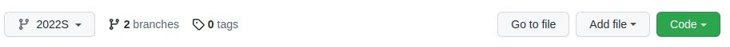
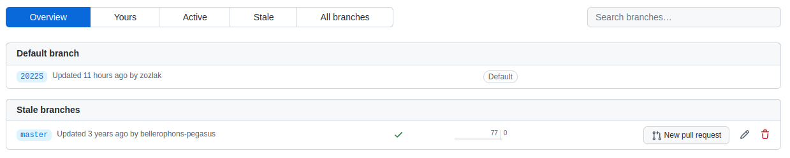
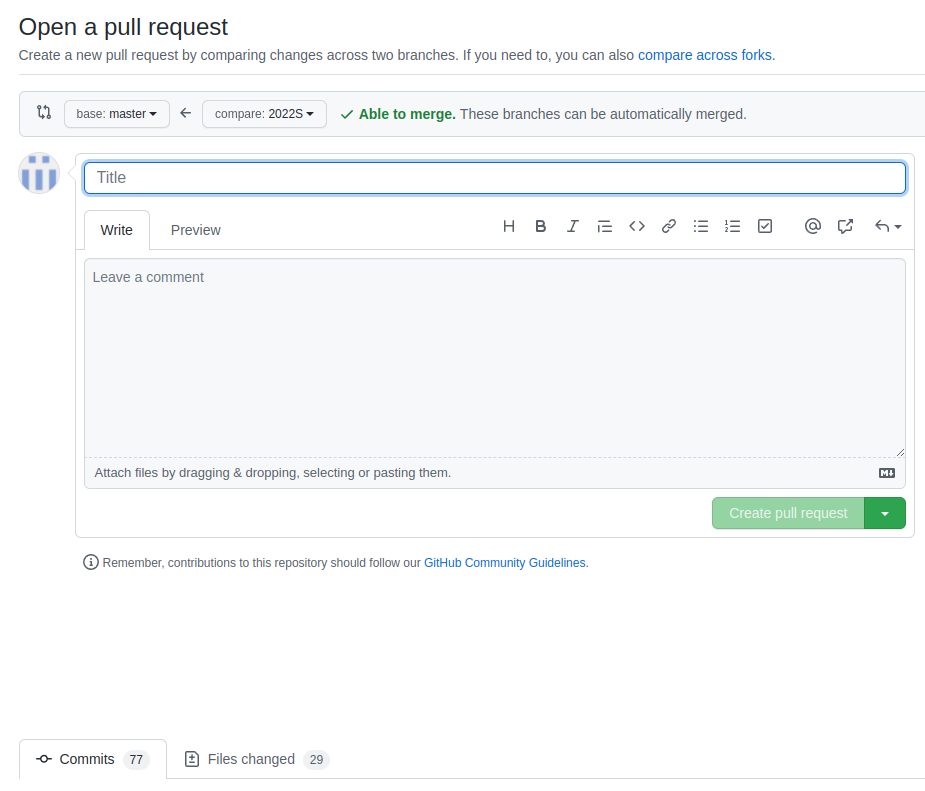

# Git 2

## Summarizing yesterdays Git lecture

### Creating a Github account and repository
* Online

### Connecting local git with Github
* `$ git config --global user.name "John Doe"`
* `$ git config --global user.email johndoe@example.com`

### Cloning a remote repository from Github
* `git clone <repository-url>` Copy an existing repository from a remote location (for example GitHub)
* `git remote` View and manage remote repositories
* `git init` Create a new repository locally

### Commiting changes from your local repository
* `git status` Show which files are modified locally or new
* `git add <filename>` Add a file to change tracking and stage  
* `git commit -m "<message>"` Make changes permanent

```bash
$ git add --all
$ git add <filename>
$ git commit -m "added a new feature some files changed"
```

### Synchronizing remote with local repository
* `git pull origin <branch>` Fetch the commits from a remote repository and merge them with the current working directory (i.e. does a fetch and a merge in one)
* `git push origin <branch>` Push the commits from the local repository to a remote repository 
* `git fetch origin <branch>` Fetch the commits from a remote repository into the local repository
* `git merge origin <branch>` Merge the commits from the local repository with commits fetched from a remote repository (actually this works on branches; this will be explained in the git tutorial part 2)

## ToDo

* Create a new Github repository (Github UI)
* Clone it to your local machine (CLI)
* Create or edit the file README.md (Atom editor)
* Run the git circle to synchronize these changes with the Github remote repository. (CLI)

## How to work with branches

What you think Git is:


What Git really is:


Command | Description
--------|------------
`git branch -a`|   Show all the branches in your local repository
`git branch -a -v` | Show all the branches and their last commits
`git branch <name>`   |   Create a new branch based on the last of commit of the current branch
`git checkout <name>` |   Switch from one branch to another
`git checkout -b <name>` | Create a new branch and switch to it
`git stash`    |   Temporarily move changed files out of the way
`git stash apply` | Reapply changes that were stashed previously

## How a merge works


Command | Description
--------|------------
`git merge <branch>` | Merge commits from one branch into the other.
`git merge --abort` | Abort a merge

### Find Branches on Github



### Merge Branches by creating a pull request



### Review commits, create title for merge (resolve merge conflicts if necessary)



* Make sure you do not have uncommitted changes.
* If so, stash them or commit them
* Check that you are in the right branch with `$ git status`.
* If not do git checkout
* Do `$ git merge <branch>`
* `$ git push`

## How to resolve a merge conflict

nano editor main commands:

You type | What happens
---- | ----
`Ctrl+S` | Save current file
`Ctrl+O` | Offer to write file ("Save as")
`Ctrl+X` | Close buffer, exit from nano

[Nano cheatsheet](https://www.nano-editor.org/dist/latest/cheatsheet.html)

vim is the default editor in Git (on all operating systems). When a merge conflict occurs you are taken into vim to resolve it. The most important vim commands are:

You type | What happens
---- | ----
`Esc` | enter command mode
`i` | enter insert mode
`:wq` | write your changes and quit
`:q!` | cancel (quit without writing changes)

The use of the escape key in Vim, the `i` for insert mode, `:wq` and `:q!` to cancel

## Forking repositories


* Log in to Github
* On Github fork the NEH Institute Materials 2017 repository
* Clone you fork to your local machine.
In your Workspace directory in your home directory do:
`$ git clone https://github.com/acdh-oeaw/Teaching_CBS4DH.git`
* On your local machine add the original repository as a second remote repository called upstream

```bash
$ git remote -v
origin  https://github.com/YOUR_USERNAME/YOUR_FORK.git (fetch)
origin  https://github.com/YOUR_USERNAME/YOUR_FORK.git (push)

$ git remote add upstream https://github.com/Pittsburgh-NEH-Institute/Institute-Materials-2017

$ git remote -v
origin    https://github.com/YOUR_USERNAME/YOUR_FORK.git (fetch)
origin    https://github.com/YOUR_USERNAME/YOUR_FORK.git (push)
upstream  https://github.com/ORIGINAL_OWNER/ORIGINAL_REPOSITORY.git (fetch)
upstream  https://github.com/ORIGINAL_OWNER/ORIGINAL_REPOSITORY.git (push)
```

## Pull requests: making changes and submitting a pull request

* Create changes
* Track changes
* Commit changes
* Push commits 
* Create pull request on github

## Notes

* A fork is a remote repository on GitHub. 
* Forking has to do with permissions.
* Explain difference between a fork and a branch
* A fork is not a branch, a fork is a repository, a branch is a series of commits.
* Explain git status "ahead / behind origin/master" line
* Explain difference between a pull and a fetch
* The Git `pull` command is not the same as a *pull request* on GitHub.
* Git does not track empty directories or empty files.

## Terms learned part 2

* Fork (GitHub term)
* Pull request (GitHub term)
* Branch
* Merge, merge commit, merge conflict

## Git Terms Cheat Sheet

* https://www.keycdn.com/blog/git-cheat-sheet

## Github Actions

Please open this link to read more: [Understanding GitHub Actions](https://docs.github.com/en/actions/learn-github-actions/understanding-github-actions)

### Example Workflow to deploy Github Pages

* Requires directories: `.github` and a sub directory `workflows` in your Github (git) repository
* Requires a file called `build.yml` stored in the `workflows` directory

#### Inside build.yml

```bash
name: Build and publish

on: 
  push:

jobs:
  build_pages:
    name: Publish as GitHub Pages Website
    runs-on: ubuntu-latest
    steps:
    - name: Perform Checkout
      uses: actions/checkout@v2
    - name: Deploy GH Pages
      uses: peaceiris/actions-gh-pages@v3
      with:
        github_token: ${{secrets.GITHUB_TOKEN}}
        publish_dir: ./html
```

Learn more about `secrets.GITHUB_TOKEN`: [Understanding GitHub automatic token authentication](https://docs.github.com/en/actions/security-guides/automatic-token-authentication)
