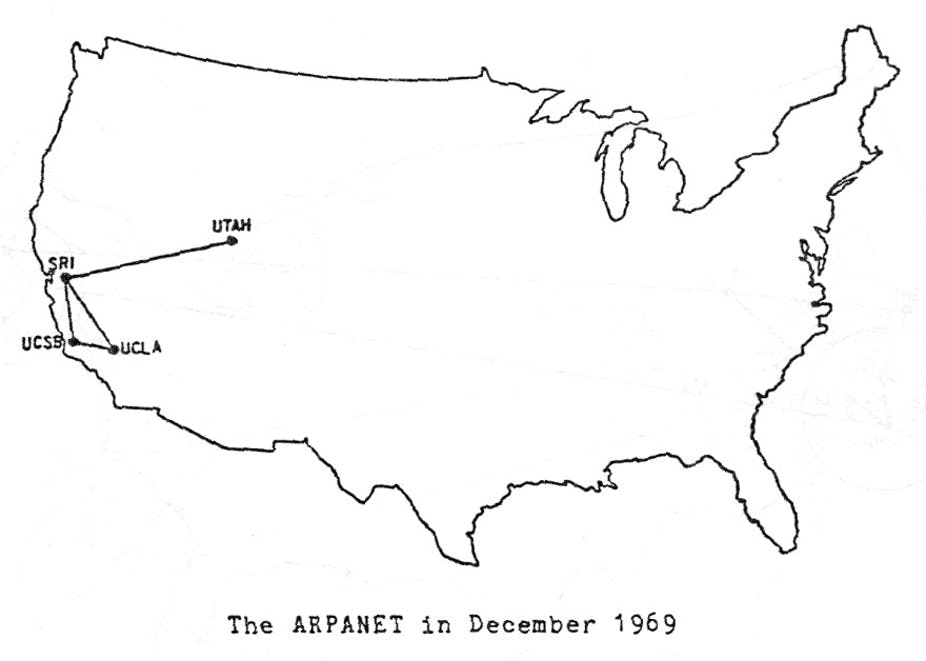

# How the Internet works

## History of the Internet

- Today’s Internet traces its beginning back to the early 1960s.
- Back then the telephone network was the world’s dominant communication network.
- Three research groups around the world, each unaware of the others’ work, began inventing packet switching networks: MIT (1961), Rand Institute (1964), National Physical Laboratory in England (1965).
- The work of these research groups came together, when they went on to lead the computer science program at the Advanced Research Projects Agency (ARPA), which was the first packet-switched computer network and a direct ancestor of today’s public Internet.
- In 1969, the ARPANET was installed at UCLA, Stanford Research Institute (SRI), UC Santa Barbara, and the University of Utah. Internet was four nodes large by the end of 1969.

Robert E. Kahn, one of the inventors of the technolgy behind Internet, explains how computers are interconnected in a packet-switching network: https://youtu.be/fVhwOaCwkb0?t=174

## Basis of the Internet Communication: Packet switching

- In a network application, end systems exchange messages with each other.
- Messages can contain anything the application designer wants, such as an email message, a JPEG image, or an MP3 audio file.
- The sender breaks long messages into smaller chunks of data known as packets.
- Between sender and receiver, each packet travels through communication links and packet switches.

What is the difference between packet-switched and circuit-switched networks?
- In circuit-switched networks, the resources needed along a path between the end systems are reserved for the duration of the communication session. Traditional telephone networks are examples of circuit-switched networks.
- In packet-switched networks, these resources are not reserved; a session’s messages use the resources on demand. 

## Protocols

A protocol defines the format and the order of messages exchanged between two or more communicating entities, as well as the actions taken using that message.

- All activity in the Internet that involves multiple remote entities is governed by a protocol.
- What happens when you make a request to a Web server? 
  - you type the URL of a Web page into your Web browser.
  - Your computer sends a connection request message to the Web server and waits for a reply.
  - The Web server receives your connection request message and returns a connection reply message.
  - Knowing that it is now OK to request the Web document, your computer sends the name of the Web page it wants to fetch from that Web server in a GET message.
  - Finally, the Web server returns the Web page (file) to your computer.

## Internet addresses

* What are IP addresses?
* Why have we run out of IPv4 addresses?
* IPv6 and its sloooowww adoption
* localhost and private IP addresses

## Network communication

* Computers run programs, which *listen* at *ports*
* Port: a number that tells the computer which program to send the message to
* Restricted ports: 0-1023
* Registered ports: everything in /etc/services
* Once you learn enough Python, you too can write a program that listens at a port!

## Network protocols

* This is how computer programs talk to each other
* Much like shells, programs have their own language that they expect
* Example! Talking to a mail server

		HELO digitalbyzantinist.org
		MAIL FROM:<mickey@digitalbyzantinist.org>
		RCPT TO:<aurum@well.com>
		DATA
		From: "Mickey Mouse" <mickey@digitalbyzantinist.org>
		To: Tara <aurum@well.com>
		Date: Wed, 12 Jul 2017 20:42:01 -0500
		Subject: my message

		Hello Tara! It's your old friend Mickey. Squeak.
		.
		QUIT
		
* Why might mail get caught in a spam filter?

## Security matters

* Telnet is from the era of the free and open internet
* Free and open to packet sniffers like `tcpdump`, that is!

		sudo tcpdump -A -n -s0 -i en0 port 80
* Secure protocols and SSL

		[winpty] openssl s_client -connect www.somesite:443
		
		GET / HTTP/1.1
		Host: byzantini.st
* What it looks like when you try to packet sniff SSL

## The Hypertext Transfer Protocol (HTTP)

* The components of a URL: protocol, host, port, path(, query, fragment)
* What happens when you run Jupyter?
* Connecting to an HTTP server
* HTTP request verbs
  * HEAD
  * GET
  * POST
  * PUT
  * DELETE
* HTTP headers
* HTTP responses
* How to make an HTTP request in Python

## References
The content of this course summarizes the relevant sections from the network technolgies textbook "Computer Networking: A Top-Down Approach" by James F. Kurose,  Keith W. Ross.

https://commons.wikimedia.org/wiki/File:Packet_Switching.gif by Oddbodz [CC BY-SA 3.0 (https://creativecommons.org/licenses/by-sa/3.0)]