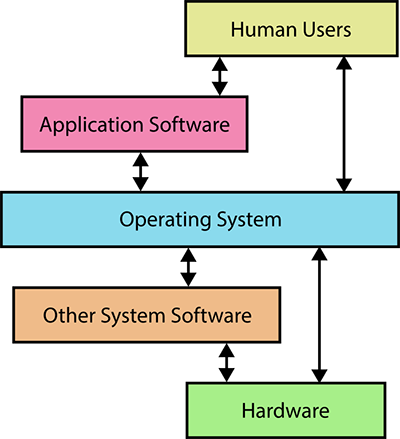

# Introduction to the course and initial setup

Welcome to the Computational Background Skills class! We will use these markdown documents to give you links and other things that it would be difficult to copy by hand. You, the students, may use it to come back to what we learned and review if needed.

## Agenda (90m session)
* [Introducing the lecturers (10m)](#introducing-the-lecturers)
* [Aims and contents of the course (10m)](#aims-and-contents-of-the-course)
* [Required Setup and Tools (30m)](#required-setup-and-tools)
* [Getting to know your OS (40m)](#getting-to-know-your-OS)

## Introducing the lecturers
Massimiliano Carloni (massimiliano.carloni@oeaw.ac.at)
Matej Ďurčo (matej.durco@oeaw.ac.at)
Tahel Singer (tahel.singer@oeaw.ac.at)
Daniel Stoxreiter (daniel.stoxreiter@oeaw.ac.at)
Florian Wiencek (florian.wiencek@oeaw.ac.at)
Mateusz Żółtak (mateusz.zoltak@oeaw.ac.at)

Please don't hesitate to reach out to the lecturers if you need any help about the lecture.

## Aims and contents of the course
This course is intended to provide basic training and support for further skills courses in the Digital Humanities. It is strongly recommended as a prerequisite to the other DH practical courses.
As such, students will be required to bring a laptop computer (no tablets!) If this presents a problem, please contact one of the course instructors in advance.
- Introduction to the command line
- Introduction to file formats and filesystems
- Solving the mystery of special characters
- Understanding how the Internet works behind the browser
- Things you ought to know about your (Mac / Windows / Linux) operating system
- Where to go for help and how to understand the answers

We will also try to accompany the contents of each course with some practical steps of the exercise, which will lead to a final project in the end.

### Grading & Attendance
Attendance in every lecture is required due to the PI type of block-course.

Regular attendance, following the practical exercise tasks during the lecture and active participation will lead to a final grade.

## Required Setup and Tools
- Create a personal GitHub account: https://github.com/join
- Download and install Atom code editor: https://atom.io/
- (Only Windows users) Download and install Gitbash: https://gitforwindows.org/

## Getting to know your OS
* [macOS](#mac)
* [Windows](#windows)

Operating systems are system software which manage computer hardware and software resources. They provide common services for computer programs and interfaces for humans to interact with.

Most common current OS's are:
* Windows (Microsoft)
* macOS (Apple)
* Linux (Linux community, open-source)
* Mobile: Android (Google, based on Linux kernel)
* Mobile: iOS (Apple)

# Mac

## File system hierarchy

* What are files?
* What are directories/folders? <!--Thinking about why we call them folders: a folder and a piece of paper are the same, and can do some of the same things. A folder can also hold pieces of paper.-->
* What are programs? <!--Programs are files that can do something, but are still files nonetheless. Take a piece of paper out of your folder, fold it into an airplane, and throw it. It's still a piece of paper you can read from and write on, but it can fly.-->
* GUI file explorers and file hierarchy
* `/` as the center of the filesystem universe (exception: Windows)
* Directories are a special kind of file
* `/dev/null`: the black hole of the file system
* Finding the filesystem location of a file from the macOS Finder:
	* Drag the filename from a Finder window and drop it into a terminal window to paste the path to the file
	* View the filename by selecting the file and `Cmd+i` (get info)
	* Right-click on a file and hold `Option`: the contextual menu will show the command `Copy {file_name} as Pathname`, which you can paste somewhere
	* Select "View > Show Path Bar" from the Finder menu bar

## Configuring your machine to show hidden files

* macOS Sierra (10.12) and later versions: Open Finder and hit `Cmd+Shift+.` Do the same thing to turn off hidden files.
* macOS El Capitan (10.11) and earlier versions: Open the command line and execute `defaults write com.apple.finder AppleShowAllFiles YES` (or `NO`); restart the Finder whenever you change this (right-click on the icon in the Dock and select "Relaunch").
* Actually, not all hidden files show up. Starting with macOS 10.12 16A238m, `.DS_Store` (_Desktop Services Store_) files are not shown. They contain information about their containing folders, such as the position of icons or the background image, and comments to the files. We will see how to show them with the command line interface (next lesson).

## Configuring your machine to show filename extensions

* Open Finder and select Preferences, click “Advanced”, and check the box next to “Show all filename extensions”.

## About files

* Why are some files hidden? <!--If you change something, however small, in some of these files, you can break your computer. Be careful!-->
* **Case sensitive** vs **case preserving**: Linux is **case sensitive**, meaning files with the same name but different capitalization are different files (e.g., `finalpaper.txt` is different than `FinalPaper.txt`). macOS and Windows are **case preserving**, but not case sensitive. <!-- (This preference can be changed when configuring the filesystem, but certain programs will not run in a case sensitive environment, so it’s best to leave it alone). A case preserving file system will spell the filename as you type it, but if you create a different file with a name that differs only in capitalization, it will overwrite the first one. We recommend not creating filenames that differ only in capitalization even on Linux; not only is it potentially confusing, but you may be collaborating on a project with someone not on Linux. -->
* **Spaces** in a file and directory names. Why could these be problematic?

## File ownership and permissions

* `ls -l` (option `-l` displays a _long_, extended list of files with all related metadata)
* user, group, other
* `chown` (You probably can’t change ownership on shared systems and don’t need to do it on your own machine. This command is useful if you install something incorrectly.)
* `chmod` (“644”, “664” for files; “755”, “775” for directories)
	* The first digit represents permissions for user; the second for group; the third for others
	* The digits should be interpreted according to the following table, from which you can sum up numbers referring to different permissions (e.g., r+w = 6)

| Permission | Octal number |
| ---------- | ------------ |
| Read | 4 |
| Write | 2 |
| Execute | 1 |

## Launching a terminal

* The **Terminal.app** that you will find in the Applications → Utilities folder. (Many Mac users prefer the free third-party <https://www.iterm2.com/>.)
* For Ubuntu Desktop (Unity): you can hit Ctrl-Alt-T or you can type `Terminal` into the Search box.
	* You can also open the current directory location in the Terminal from the file explorer (Nautilus): just right-click on an empty space of the window and select "Open in Terminal".
	* Otherwise, you can click on the name of the active directory in the breadcrumb and click on "Open in Terminal".

## Moving through a filesystem
<!-- Move the programs and files stuff in here, use cmd.exe -->
<!-- where is home?  both in cmd and in gui-->
<!-- language differences for gui and command line-->

* Navigate up and down, with emphasis on the paths in the title bar 
* `cd`: change directory <!--Open a command line and begin using `cd`. Explain that `cd` is essentially the same as selecting or clicking on a folder. `cd` into your home directory.-->
* `ls`: list all files  <!--Use `ls` to show all the files in your current (when you first open the terminal, home) directory. Compare that to what you now see in your home directory (or C drive “folder”). Then use `cd Documents` to move into your documents folder. This is a relative path, as you’ve navigated relative to where you’ve started. Explain what an absolute path looks like, and try running one. Then run a few relative paths.-->

## File/directory path in file explorer GUI vs. shell

* Matching the GUI file path with the file/directory path in the terminal
* User-specific directories: where are your home directory, document folder, and desktop? What are their full file/directory paths? 
* Non-English OS’s may have translation/localization applied, but only on the GUI side! Why is this?

## External drives and mounting
How removable and external drives (such as a USB thumbdrive) are treated in GUI vs. terminal environment

* In macOS, they are mounted underneath `/Volumes` when you plug them in. Unmount them by following the instructions at [Mount and unmount drives from the command line in Mac OS X](http://osxdaily.com/2013/05/13/mount-unmount-drives-from-the-command-line-in-mac-os-x/). 
 	
## How to run a program as an administrator

* The GUI will generally ask you if you need to do this
* On the command line, precede the command with `sudo`.

# Windows

## File system hierarchy 

* What are files?
* What are directories/folders? <!--Thinking about why we call them folders: a folder and a piece of paper are the same, and can do some of the same things. A folder can also hold pieces of paper.-->
* What are programs? <!--Programs are files that can do something, but are still files nonetheless. Take a piece of paper out of your folder, fold it into an airplane, and throw it. It's still a piece of paper you can read from and write on, but it can fly.-->
* GUI file explorers and file hierarchy
* Finding the filesystem location of a file from Windows Explorer, renamed File Explorer starting from Windows 8:
	* Drag the file icon from a File Explorer window and drop it into a terminal window to paste the path to the file
	* View the filename by right-clicking on the file and selecting "Properties"
	* Press and hold `Shift` and right-click on a file: the contextual menu will show the command `Copy as path`.
	* Select a file, click on the "Home" tab in the ribbon and select "Copy path".

## Configuring your machine to show filename extensions

* <[screenshot](images/getting_to_know_winconfig.png)> In any File Explorer window, click on “View” tab, and then “Options” on the right to open the “Folder Options” window. 
	* In the “View” tab, uncheck “Hide extensions for known file types” box.

## Configuring your machine to show hidden files, and more

* <[screenshot](images/getting_to_know_winconfig.png)> In the same “Folder Options” window as before, 
	* Check “Show hidden files, folders, and drives”. 
		* NOTE: Protected operating system files will still stay hidden.  
	* Also check “Display the full path in the title bar” (not essential, but recommended).

## About files

* Why are some files hidden? <!--If you change something, however small, in some of these files, you can break your computer. Be careful!-->
* **Case sensitive** vs **case preserving**
	* Linux is **case sensitive**, meaning files with the same name but different capitalization are different files (e.g., `finalpaper.txt` is different than `FinalPaper.txt`). 
	* macOS and Windows are **case preserving**, but not case sensitive. <!-- (This preference can be changed when configuring the filesystem, but certain programs will not run in a case sensitive environment, so it’s best to leave it alone). A case preserving file system will spell the filename as you type it, but if you create a different file with a name that differs only in capitalization, it will overwrite the first one. We recommend not creating filenames that differ only in capitalization even on Linux; not only is it potentially confusing, but you may be collaborating on a project with someone not on Linux. -->
* **Spaces** in a file and directory names. Why could these be problematic? 

## Launching a terminal

* The Command Prompt **cmd.exe** <[screenshot](images/getting_to_know_cmd.png)> is the native Windows console, which grew out of DOS.  We will be using it in this session. 
	* How to launch: from the Start menu type in “cmd”. 
	* NOTE: For later sessions and the remainder of this course we will be using the **bash shell** instead, which you downloaded and installed as part of Git. This is the command line interface we use and recommend.

## Moving through a filesystem
<!-- Move the programs and files stuff in here, use cmd.exe -->
<!-- where is home?  both in cmd and in gui-->
<!-- language differences for gui and command line-->

* Navigate up and down, with emphasis on the paths in the title bar <!-- We should clarify that Git Bash will use forward slashes rather than backslashes, and explain later when we introduce cmd why that's the case.-->
* Drive letter in Windows: `C:\Users` (Windows `cmd`)
	* Drive letter elsewhere: `/c/Users` (Windows Git `bash`), `/Users` (no drive letter in macOS and Linux)
* `cd`: change directory <!--Open a command line and begin using `cd`. Explain that `cd` is essentially the same as selecting or clicking a folder. `cd` into your home directory.-->
* `dir`: list all files

## File/directory path in File Explorer GUI vs. cmd 

* Matching the GUI file path with the file/directory path in the terminal
* User-specific directories: where are your home directory, document folder, and desktop? What are their full file/directory paths? 
* Non-English OS’s may have translation/localization applied, but only on the GUI side! 
	* In Spanish Windows, a user’s Documents folder would appear in File Explorer as “Usarios > jeremy > Documentos”
	* The same folder will appear on the command line as `C:\Users\jeremy\Documents`

## External drives and mounting
How removable and external drives (such as a USB thumbdrive) are treated in GUI vs. terminal environment

* In Windows, they are assigned a new drive letter: `d:\` `e:\` (cmd)
* In Git bash environment (will learn this later), they look like: `/d/` `/e/` 

## How to run a program as an administrator

* Right click on a program icon (say, Command Prompt) and select “Run as administrator”. 
	* **CAUTION!** You may accidentally break your system by removing essential files or directories.
	* Use only when you have a good reason to; close program when done. 

## Environment variables (aka system variables)

* How to view environment variables through a GUI
	* File Explorer -> Right click on 'This PC', select 'Properties' -> Advanced System Settings -> Environment Variables 
* How to view environment variables in a terminal
	* In `cmd`, type in: `set`
