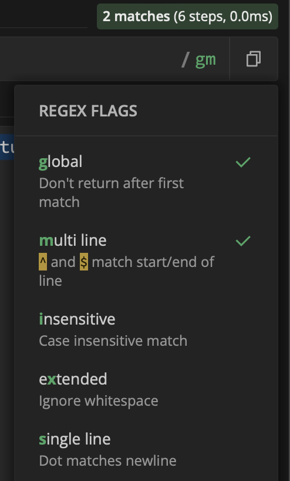

# Regular Expressions 2

## Greediness and laziness

Let's take this sample sentence (which already hints at our frustration in a couple of seconds):

```
I would like my regex to take this sentence, but it actually takes more, and I don't know why!
```

We would like to write a regex that takes the text **until the first comma**. Our best guess would be to write a regex like `.+,` (to also allow for other non-alphanumeric characters before the comma). However, what our regex engine matches is not the text until the first comma, but the text **until the *second* comma**. Why?

Because repeating qualifiers (like the `+` we used) are **greedy** by default behaviour. This means they tend to take **as much text as possible** (actually, in the case of `.+` the whole text of the document) and then take steps back (**backtrack**) until they satisfy the required condition (in our case, that a comma must be at the end of the string).

One possible solution would be to make this repeating qualifier **lazy**. We can do this by adding a question mark `?` just after the repeating qualifier, so our regex will become `.+?,`

> [!NOTE]
>
> The question mark `?` used as a **modifier** to make a repeating qualifier lazy should not be confused with the question mark `?` used as a **repeating qualifier** itself (meaning zero or one repetition, as we saw in the previous section).

Another solution would be to use a different regex, for example one where we **exclude the character *comma*** in a set with a repeating qualifier, and then add the comma outside the set: `[^,]+,`

(The latter solution is actually more efficient from a computational point of view.)

## Anchors

Anchors match a pattern based on its position in the string. They are useful for defining the context in which a pattern should be matched within a text, allowing for more precise and controlled matching.<br>


<!-- #### Examples:

| String | RE | Match |
| --- | --- | --- |
| complicated | `^comp` | Yes |
| appreciated | `ed$` | Yes |
| rain | `^rain$` | Yes |
| rain | `^r[ai]+n$` | Yes |
| complicated | `^comp.*ed$` | Yes |

### Special sequence anchors

| Special sequence |  Matches at |
| --- | --- |
| `\b` | a word boundary |
| `\B` | not a word boundary |

A word boundary is a position between a character that can be matched by the set of characters of `\w` and a character that cannot be matched by `\w`. `\b` also matches at the ends of the string if the first/last characters in the string are word characters. `\B` matches at every position where `\b` cannot match.

| String | RE | Match |
| --- | --- | --- |
| complicated | `\bcomp` | Yes |
| appreciated | `\Bed\b` | Yes |
| rain | `\brain\b` | Yes |
| rain | `$r[ai]+n\b` | Yes |
| complicated | `\bcomp.+\b` | Yes | -->


| String      | RE           | Match |
| ----------- | ------------ | ----- |
| complicated | `^comp`      | Yes   |
| appreciated | `ed$`        | Yes   |
| rain        | `^rain$`     | Yes   |
| rain        | `^r[ai]+n$`  | Yes   |
| raaaain     | `^r[ai]+n$`  | Yes   |
| complicated | `^comp.*ed$` | Yes   |


Note: Most _RE engines_ have a _multi-line_ mode that makes _caret_ `^` match after any line break, and _dollar_sign_ `$` before any line break.

**Remarks:**

- `^pattern$` has the meaning of a total match

## Special sequence anchors

| Special sequence | Matches at          |
| ---------------- | ------------------- |
| `\b`             | a word boundary     |
| `\B`             | not a word boundary |

A word boundary is a position between a character that can be matched by the set of characters of `\w` and a character that cannot be matched by `\w`. `\b` also matches at the ends of the string if the first/last characters in the string are word characters. `\B` matches at every position where `\b` cannot match.

| String      | RE           | Match |
| ----------- | ------------ | ----- |
| complicated | `\bcomp`     | Yes   |
| appreciated | `\Bed\b`     | Yes   |
| rain        | `\brain\b`   | Yes   |
| rain        | `$r[ai]+n\b` | Yes   |
| complicated | `\bcomp.+\b` | Yes   |

## Substitution

Regular expression can be also used for the search & replace.

In the simple case you just search using the regular expression and replace it with a fixed text (try it out on the regex101 using the **Substitution** function).

On top of that it is possible to use a selected parts of the match in the replace (so-called _backreferences_):

- _Backreference_ are defined using brackets, e.g. `a(.)b(.c.)d` defines two of them
  - any single character between a and b,
  - a sequence of any character, c and any character in between of a and d.
- How to refer to _backreferences_ in the replace string depends on the regular expressions engine but two most popular syntaxes are `\\backreferenceNumber` and `$backreferenceNumber`, e.g. `\\1` and `$1` (you can try it out on the regex101 by choosing various flavors).

As an example let's naively reorder a conditional sentence:

- search for: `(.*), ?(.*)[.]`
- replace with: `$2, $1.`
- test string: `if you see a red light, stop.`
- result: `stop, if you see a red light.`

## Flags

To enable some more flexibility or specification during the search for the pattern, some regex flags can be used. We will quickly overview the important ones that can be integrated in more complicated patterns:

- **global** **(g)** search through the whole string, and do not return just after the first occurence
- **multi line** **(m)** total string match, equal to: `^pattern$`
  - when you have multi line activated, the caret `^` and the dollar sign `$` match beginning and end of each line
  - with no multi line, the same symbols `^` and `$` match beginning and end of the whole string (i.e., the whole text/document you have)

- **insensitive** **(i)** case insensitive search (both lower and upper case search)
- **extended** **(x)** ignore whitespace

**Remarks**:

- In some applications, you can use flags **inline** by specifying them at the end of a regex pattern, using the letter specified in brackets above, e.g. `/pattern/m` (for multi line)
- Flags available and their exact behavior may (and do) vary between regex implementations (check it on [regex101](https://regex101.com) by choosing different flavors; you can change flags by clicking on the green letters at the end of the regular expression field: see screenshot). Check the documentation of the app/language for details.
- Some applications (most notably text editors) do not expose flags or do it indirectly (e.g. with a "ignore case" checkbox in the search dialog).



## Where can you use regular expressions?

All around! (which is why we are learning them)

Particularly:

- In almost any text editor.
- In Google Docs and LibreOffice (but surprisingly not in Ms Office).
- In dedicated tools (like the [regex101](https://regex101.com/) we used here)
- In each and every serious programming language.
- In each and every [IDE](https://en.wikipedia.org/wiki/Integrated_development_environment) (once you start programming).
- In CLI tools like `grep` (find matching files/lines) or `sed` (find & replace).
- In many digital corpora and text collections.

## Regex with Python

We will now focus on using Regex in _Python_, with the help of the library _re_. 
To start, go to the "exercises" folder - here you will find a [Jupyter Notebook](https://jupyter.org/) called "Regular_Expressions_in_Python_CBS4DH.ipynb".
Download it (or better find it in your cloned repository) and open it with [Google Colab](https://colab.google/) or - in case you already have Python installed - with Visual Studio Code.

## Regex in Corpora and Text Collections

Many digital corpora and collections offer the possibility to optimize or expand one's full text or metadata search through regular expressions. Here are two exemplary German and one exemplary English resources where this can be applied:

- **Deutsches Textarchiv (DTA)**: [Corpus](https://www.deutschestextarchiv.de/) | [Documentation](https://www.deutschestextarchiv.de/doku/DDC-suche_hilfe#suche_mit_regul)
- **Wienerisches DIGITARIUM**: [Corpus](https://digitarium-app.acdh.oeaw.ac.at/) | [Documentation](https://digitarium-app.acdh.oeaw.ac.at/search.html?id=jg17xx)
- **Brown Corpus**: [Corpus](https://app.sketchengine.eu/#dashboard?corpname=preloaded%2Fbrown_1) | [Documentation](https://www.sketchengine.eu/quick-start-guide/concordance-lesson/)

> [!NOTE]
> Different corpora and collections often involve specific ways to search with regex - (reading the) documentation is key!

**Tasks**

- Use Regex to find the longest word given within each of these corpora - which words are the longest and how many characters do they (approximately) have? Which differences do you witness between the different corpora during your search?
- Historically, the German word _Kurier_ has appeared in a variety of writing variants, such as: _Courrier, Currier, Curier, Curir, Courier, Courir, Kourrier, Kurrier, Kurier, Kurir, Kourier, Kourir, Courrir, Currir, Kourrir, Kurrir_ - formulate one regular expression to catch all of these variants! How many can hits do you get within Deutsches Textarchiv?
- Which other research question(s) could you ask with the power of Regex?

<!--

## More ambitious task

If we still have time, we can try to convert a Wikipedia's "year overview" to a spreadsheet (a CSV file).

* Open https://de.wikipedia.org/wiki/2011 . As you can see it's a large page describing what happened in 2011. The information is grouped in various ways: by country, by date or by topic.
* Let's try to choose one grouping and:
  * Extract it from the whole content
  * Split it into single records looking as `"header","content"` (header will be a country for grouping by country, date for grouping by date, etc.), e.g.
    ```
    "2. Januar","Ein Erdbeben der Stärke 7,1 erschüttert Chile."
    "5. Januar","Ein Erdbeben der Stärke 5,4 verursacht im Iran einige Schäden. Es gab 16 Verletzte."
    (...)
    ```
    This is a so-called CSV format which can be easily opened in a spreadsheet app (e.g. Ms Excel).
* To make our lives easier let's work with the [source code](https://de.wikipedia.org/w/index.php?title=2011&action=edit) of the page. Just copy it to any application you like (your favourite text editor or the regex101 or whatever) and try to search & replace it using regular expressions to get to the format mentioned in the previous point.
  * There is no single right result of this task and countless number of regular expressions leading to them. Just play around until you are satsified with the results.
  * It is a complex task so try to divide it into smaller steps, e.g.
    * Start with extracting the part of the whole document you are interested in (note that extracting is the same as "removing the other parts").
    * Then find a way to match the whole "record".
    * Finally try to split each record into header and content.
-->
